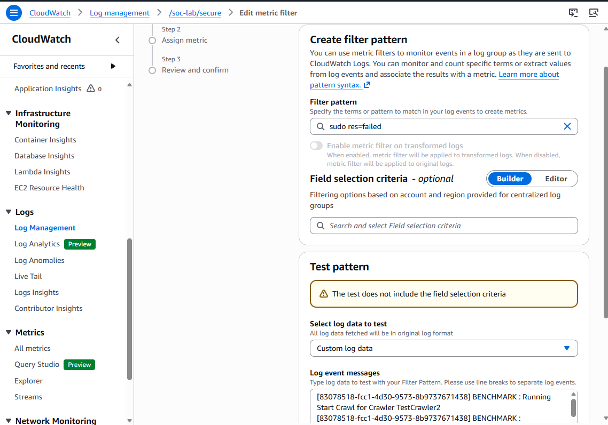
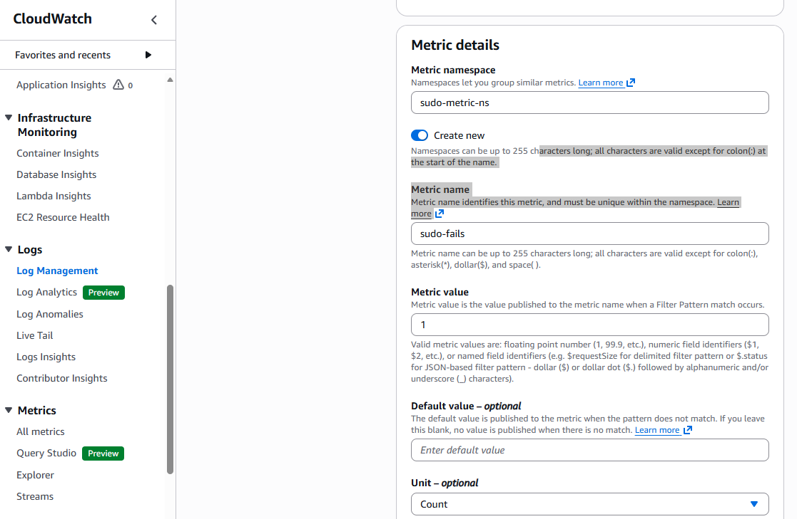
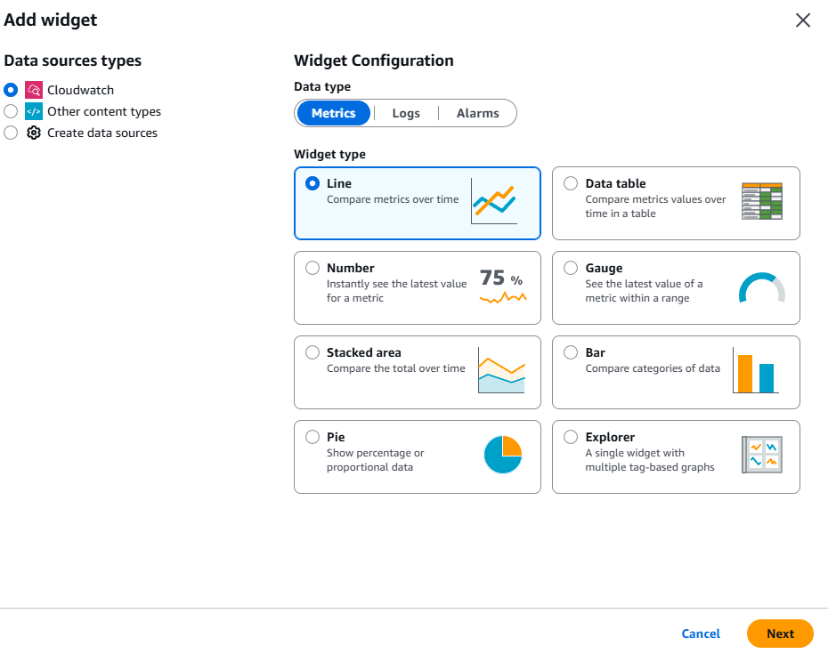
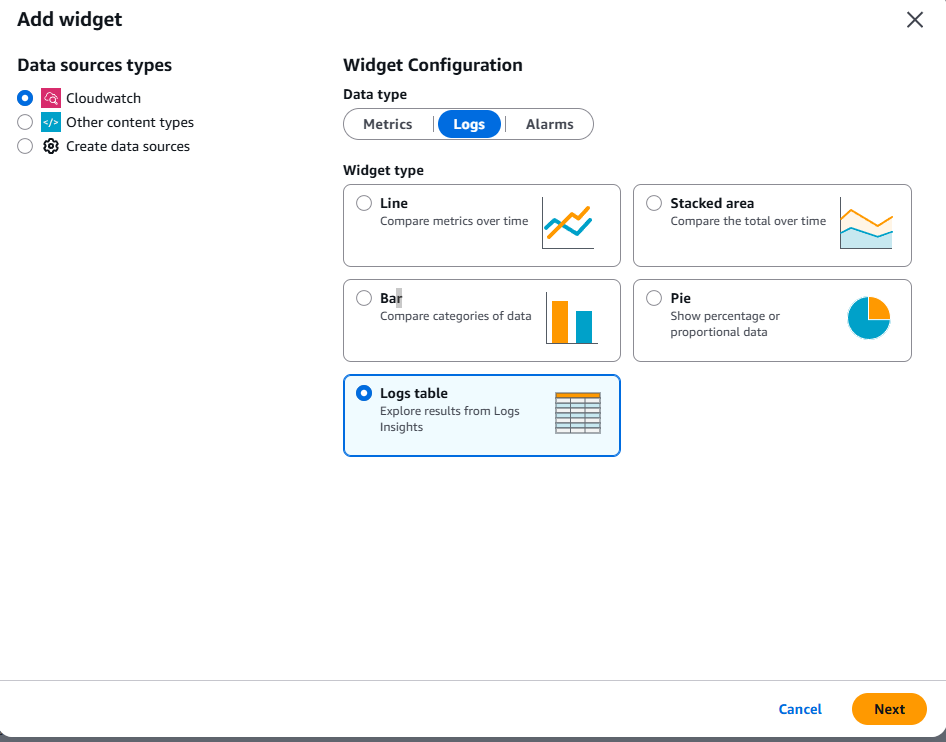
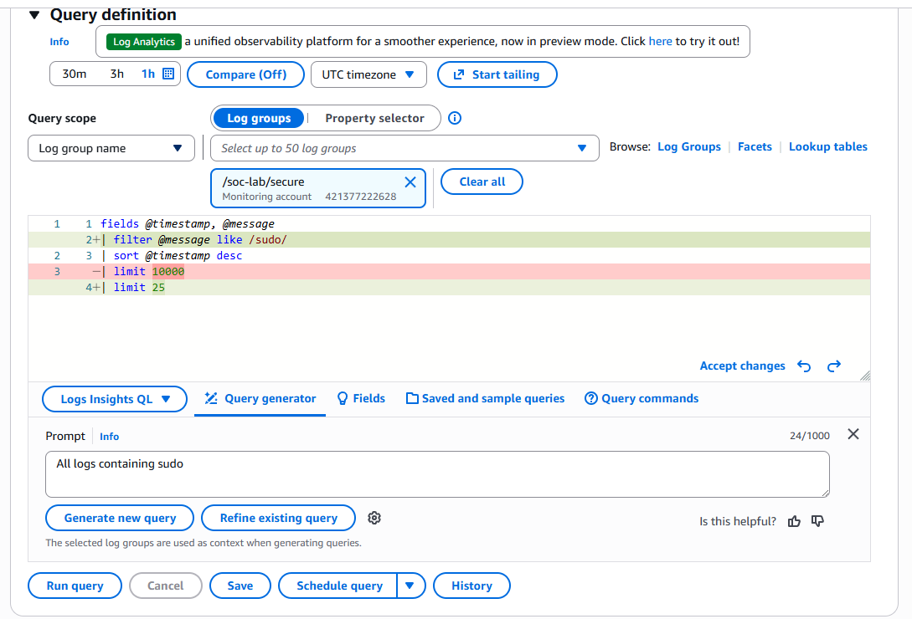
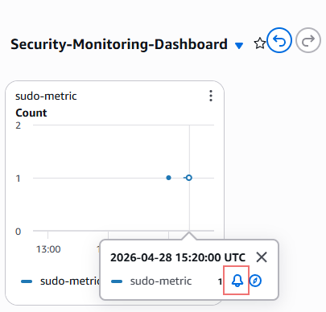

## Lab 2.2: Security Monitoring Dashboard and Automated Detection

This lab builds a live security detection system around one high-signal rule: failed `sudo` attempts. In production, `sudo` should be used infrequently — repeated failures indicate either a misconfigured account or an active privilege escalation attempt. You will create a metric filter to count these events, build a CloudWatch dashboard with seven analyst-focused queries, configure an alarm, and wire it to an AI Operations investigation that triggers automatically when the threshold is breached.

## Attacker Objective (Cyber Lens)

Objective: Repeatedly attempt privilege escalation using a low-privilege account to trigger detection.
ATT&CK focus: T1078 (Valid Accounts), T1548 (Abuse Elevation Control Mechanism).
Defender outcome: Confirm that failed sudo events are counted, visualized, alarmed, and routed to AI triage without manual intervention.

## Learning Objectives

By the end of this lab, you will be able to:

1. Create a CloudWatch metric filter to count security-relevant log patterns.
2. Build a multi-widget CloudWatch dashboard using Logs Insights queries.
3. Configure a CloudWatch alarm on a custom log metric.
4. Wire an alarm action to automatically trigger an AI Operations investigation.
5. Prepare a low-privilege test account on EC2 for attack simulation.

---

## Prerequisites

- `/soc-lab/secure` log group with active auditd log ingestion.
- AWS Console access in `us-east-1`.
- SSH access to your `soc-lab` EC2 instance.

---

## Part 1: Create the Metric Filter

A metric filter tells CloudWatch to watch every log event in a log group and increment a custom metric counter when it matches a pattern. You will count every failed sudo command.

1. In the AWS Console, navigate to **CloudWatch** → **Logs** → **Log groups**.

2. Click **/soc-lab/secure**.

3. Click the **Metric filters** tab, then click **Create metric filter**.

4. For **Filter pattern**, enter:

   ```
   sudo res=failed
   ```

   

5. Before saving, test the pattern. In the **Test pattern** section, click **Select log data to test** and pull recent log events from the log group. Run the test and confirm matching events are highlighted. If no matches appear, paste a sample auditd line containing `sudo` and `res=failed` manually to verify the pattern fires.

6. Click **Next**.

7. Set the following:
   - **Filter name**: `sudo-failed-attempts`
   - **Metric namespace**: `SOCLab`
   - **Metric name**: `SudoFailedAttempts`
   - **Metric value**: `1`
   - **Default value**: `0`

   

8. Click **Next**, review, then click **Create metric filter**.

---

## Part 2: Prepare the Test Account on EC2

You need a low-privilege user to generate failed sudo events for attack simulation. Set that up now.

SSH into your `soc-lab` EC2 instance and run:

```bash
sudo useradd -m testattacker
sudo passwd testattacker
```

When prompted, set a simple password you will remember (e.g., `Test1234!`).

Do not add this user to the `wheel` or `sudo` group — that is intentional. They should not have sudo access.

Verify:

```bash
id testattacker
```

The output should show no `wheel` group membership.

---

## Part 3: Build the Dashboard

Navigate to **CloudWatch** → **Dashboards** → **Create dashboard** and name it `soc-lab-sudo-monitor`.

For each widget below: click **Add widget**, select the chart type and source as specified, then configure the query or metric. When building each widget, **do not enable "Persist time range"** — leave it off so the dashboard time range control applies globally.

---

### Widget 1 — Sudo Failure Count (Line Chart)

**Type**: Metrics → Line



In the metric browser, navigate to **SOCLab** → **SudoFailedAttempts**. Select it.

Under **Graphed metrics**:
- Statistic: **Sum**
- Period: **5 minutes**

Title: `Sudo Failure Count`

---

### Widget 2 — All Sudo Log Events (Logs Table)

**Type**: Logs table



Log group: `/soc-lab/secure`

Query:
```
fields @timestamp, @message
| filter @message like /sudo/
| sort @timestamp desc
| limit 50
```

Title: `All Sudo Events`

---

### Widget 3 — Sudo Events by Audit Type (Bar Chart)

**Type**: Bar chart

Log group: `/soc-lab/secure`

Query:
```
fields @timestamp, @message
| filter @message like /sudo/
| parse @message "type=* msg=" as auditType
| stats count(*) as eventCount by auditType
| sort eventCount desc
```

Title: `Sudo Events by Type`

---

### Widget 4 — Sudo Activity by User (Logs Table, no visual)

**Type**: Logs table

Log group: `/soc-lab/secure`

Query:
```
fields @timestamp, @message
| filter @message like /sudo/
| parse @message "UID=\"*\"" as UID
| stats count(*) as eventCount by UID
| sort eventCount desc
```

Title: `Sudo Activity by User`

---

### Widget 5 — Failed Sudo Command Detail (Logs Table, no visual)

**Type**: Logs table

Log group: `/soc-lab/secure`

Query:
```
fields @timestamp, @message
| filter @message like /exe="\/usr\/bin\/sudo"/
| filter @message like /res=failed/
| parse @message /type=(?<eventType>\w+)/
| parse @message /uid=(?<uidNum>\d+)/
| parse @message /auid=(?<auidNum>\d+)/
| parse @message /UID="(?<uidName>[^"]+)"/
| parse @message /AUID="(?<auidName>[^"]+)"/
| parse @message /acct="(?<targetAcct>[^"]+)"/
| display @timestamp, eventType, uidNum, auidNum, uidName, auidName, targetAcct, @message
| sort @timestamp desc
```

Title: `Failed Sudo Detail`

---

### Widget 6 — Failed Attempts by User (Logs Table, no visual)

**Type**: Logs table

Log group: `/soc-lab/secure`

Query:
```
fields @timestamp, @message
| filter @message like /exe="\/usr\/bin\/sudo"/
| filter @message like /res=failed/
| parse @message /UID="(?<user>[^"]+)"/
| parse @message /AUID="(?<originUser>[^"]+)"/
| parse @message /type=(?<eventType>\w+)/
| stats count(*) as failedAttempts by user, originUser, eventType
| sort failedAttempts desc
```

Title: `Failed Attempts by User`

---

### Widget 7 — Additional Exploration

Use the **Query Generator** (Ask AI to write a query) to create at least one additional widget relevant to privilege escalation — for example, who ran sudo successfully, what commands were attempted, or which users have the highest audit event frequency. Use your judgment on chart type.



Title: your choice.

---

## Part 4: Create the Alarm

1. In the dashboard, hover over the **Sudo Failure Count** line chart widget. A bell icon or **Create alarm** option will appear — click it.

   

   > If you do not see the option on hover, navigate directly to **CloudWatch** → **Alarms** → **Create alarm** → **Select metric** → **SOCLab** → **SudoFailedAttempts**.

2. Configure the alarm conditions:
   - **Statistic**: Sum
   - **Period**: 1 minute
   - **Threshold type**: Static
   - **Condition**: Greater than or equal to `1`

3. Click **Next** to configure actions.

4. Under **Alarm state trigger**, select **In alarm**.

5. Add an **SNS notification** (optional):
   - Create a new SNS topic named `soc-lab-alerts`
   - Add your email address if you want to receive alert emails
   - If you skip the email, the topic still exists for future use

6. Add an **AI Operations investigation** action:
   - Look for the investigation action type in the actions panel
   - This automatically creates an AI Operations investigation when the alarm fires — no manual step required

7. Under **Alarm description**, write something like:

   ```
   Detected 1 or more failed sudo attempts within a 1-minute window on /soc-lab/secure.
   Possible privilege escalation attempt. Review the soc-lab-sudo-monitor dashboard and
   the auto-triggered AI investigation for triage.
   ```

   Include the direct URL to your dashboard if you want a quick link in the alarm detail page.

8. Name the alarm `sudo-failed-alarm` and click **Create alarm**.

---

## Conclusion

You built a detection pipeline from the ground up: a metric filter counts failed sudo events, a dashboard visualizes them across seven lenses, and an alarm automatically routes detections to both an SNS notification and an AI Operations investigation.

### Lab Checkpoint

Confirm before continuing:

- Metric filter `sudo-failed-attempts` exists on `/soc-lab/secure`
- Dashboard `soc-lab-sudo-monitor` has all 7 widgets and displays data
- Alarm `sudo-failed-alarm` is in **OK** or **Insufficient data** state (not yet triggered)
- SNS topic `soc-lab-alerts` exists (email subscription optional)
- AI Operations investigation action is attached to the alarm
- User `testattacker` exists on the EC2 instance with no sudo privileges
